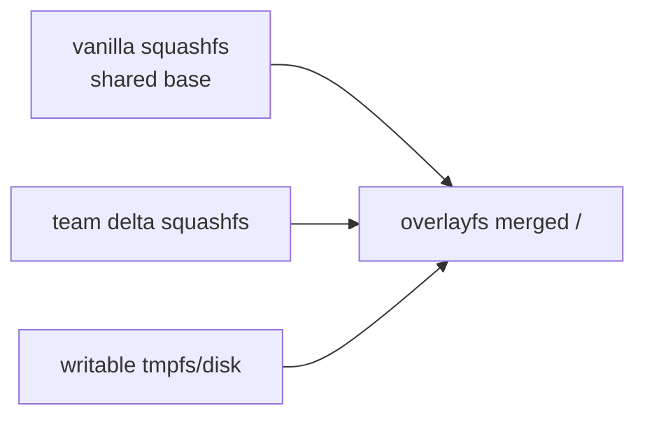
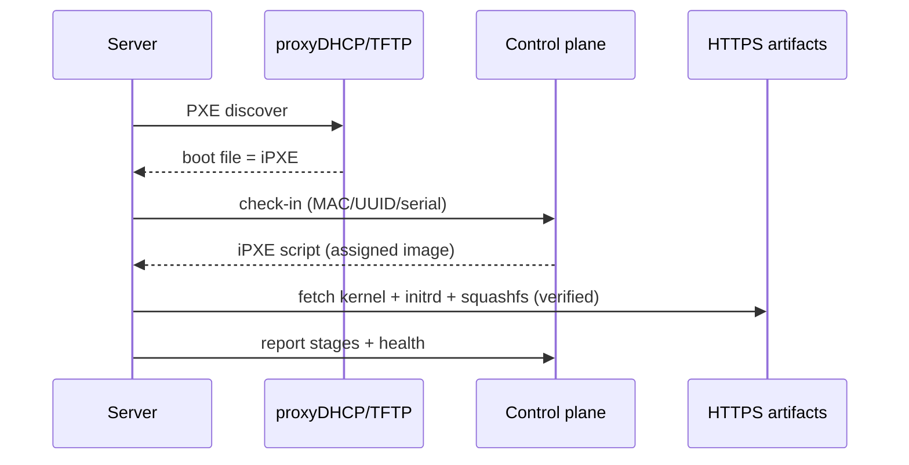
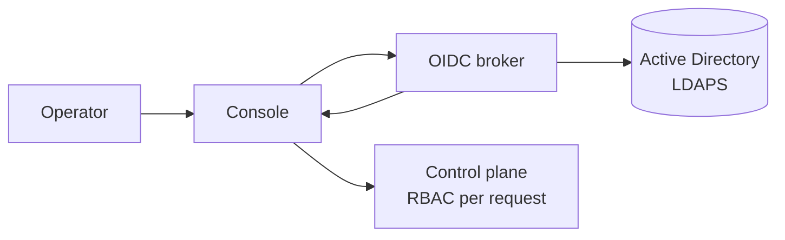

# PXE Boot & Layered ISO Provisioning System

> Confluence page material — copy/paste into Confluence. ASCII diagrams render
> as-is; Mermaid blocks render if the Mermaid macro/plugin is installed.
> **Status:** Design proposal for review.

---

## 1. Overview

- Network-provisions bare-metal servers from a **two-layer image model**
- **Vanilla** = shared hardened Ubuntu 20.04 base; **Adaptation** = per-team layer on top
- Driven by **PXE boot** + an **operator UI** to pick servers and image them
- **LDAP/Active Directory** login, full **audit logging**, **debug + retry** built in

```
   BUILD (CI)                    RUN (provisioning)                 FLEET
 +-------------+   signs     +--------------------+   boots     +-----------+
 |  Vanilla    |  images     |  Control plane     |  decision   |  Server A |
 |  + Team     +-----------> |  + Operator UI     +-----------> |  Server B |
 |  builders   |             |  + AD login + Audit|             |  Server N |
 +-------------+             +--------------------+             +-----------+
       |                            |     ^                          |
       v                            v     | check-in (MAC/UUID)      |
   Image catalog  <----- serves ----+     +--------------------------+
   (squashfs/ISO)        HTTPS                 logs + status
```

---

## 2. Requirements

### Goals
- Reproducible, signed, versioned **vanilla** image (squashfs + ISO)
- Per-team **adaptation** images from a spec, on a pinned vanilla, signed/versioned
- PXE-boot any server; central control plane decides what it boots
- Simple operator UI: discover servers, select, pick image, provision/reimage/retry/debug
- Operator login via **Windows AD (LDAP)** with role-based access
- Audit every action + centralize build/provisioning logs
- Debuggable layers + boot: isolate broken layer, keep logs, rescue env
- Automatic retry + rollback (self-heal or park cleanly)

### Non-goals (v1)
- Non-Ubuntu / non-x86 targets
- Post-first-boot config management (hand off to team's CM)
- Replacing production DHCP (use proxyDHCP)
- Multi-datacenter federation

### Functional
- Discover machines (DHCP leases, iPXE check-ins, optional ARP/LLDP)
- Bind machine → image + version + action
- Drive machine to that state on next boot; remote power via IPMI/Redfish
- Stream live progress per machine to UI
- Rescue/debug boot + per-machine retry/rollback from UI
- Image catalog: list/promote/deprecate versions

### Non-functional
- Reproducible builds (pinned packages, snapshot repos)
- Integrity: signed artifacts, verified before boot
- Auditability: who/what/when/which-server/which-image, immutable
- Resilience: no silent bricking; logs survive reboot
- Least privilege: RBAC, segmented network, no secrets in shared images
- Coexist with existing network services

---

## 3. Two-Layer Image Model

- **Vanilla** built once → one immutable squashfs (shared by all teams)
- **Adaptation** = delta squashfs per team (only what the team adds/changes)
- Compose via **overlayfs at boot**; also emit a merged ISO per team
- Independent versioning/signing → can tell "vanilla broke" vs "team layer broke"

```
   At boot on the target server:

   +-----------------------------+   writable (tmpfs / disk)   <- top
   +-----------------------------+
   |  team-payments-2.1.0        |   upper  (per-team delta)
   +-----------------------------+
   |  vanilla-20.04-1.4.0        |   lower  (shared base)      <- bottom
   +-----------------------------+
            = merged "/" via overlayfs
```



---

## 4. Build Pipeline

- Tooling: **debootstrap + chroot**, packages from a **snapshotted apt mirror** (reproducible)
- Vanilla → squashfs + ISO + kernel/initrd + manifest/SBOM + signature
- Adaptation → delta squashfs (+ merged ISO), records pinned `base_vanilla` provenance
- Every build smoke-boots in a VM + runs the first-boot health check before promote

```
 apt snapshot --> [Vanilla builder] --> vanilla.squashfs + ISO --+
                       |                                          +--> sign + SBOM --> Catalog
 team spec ---------> [Adaptation builder] (on pinned vanilla) ---+
```

---

## 5. PXE Boot Flow

- **proxyDHCP** (dnsmasq) gives only boot options — prod DHCP still assigns IPs (no disruption)
- **TFTP** serves the tiny iPXE binary; everything big over **HTTPS**
- **iPXE** calls back to control plane with MAC/UUID/serial → gets a per-machine boot script
- Control plane decides: team image / vanilla / previous-good / rescue / boot-local



```
 Power on --> proxyDHCP --> TFTP(iPXE) --> check-in to API
   --> fetch+verify image over HTTPS --> overlay boot --> agent
   --> health check --> Healthy / (Failed -> retry/rollback/rescue)
```

---

## 6. Operator UI

- **Inventory grid**: MAC, IP, serial, state (color-coded), current image, last seen, BMC
- **Workflow**: select server(s) → pick image + action + run-mode → provision/reimage
- **Live status drawer**: per-server progress + inline log tail
- **Buttons**: Retry, Rollback to previous, Send to rescue, Open console, Boot local
- **Supporting**: image catalog (promote/deprecate), audit log (searchable)

```
 +------------------------------------------------------------+
 | [Filter] [Image v]  [Action v]  [ Provision ]   (AD user)  |
 +------------------------------------------------------------+
 | [x] SRV-A  10.0.0.11  SN1234  Healthy   payments-2.1.0     |
 | [x] SRV-B  10.0.0.12  SN1235  Installing.. vanilla-1.4.0   |
 | [ ] SRV-C  10.0.0.13  SN1236  Failed    payments-2.0.0     |
 +------------------------------------------------------------+
 | Live: SRV-B  [###### 60%] fetching squashfs...  (log tail) |
 +------------------------------------------------------------+
```

---

## 7. Authentication (Windows AD / LDAP)

- Operators log in with their **Active Directory** identity
- Recommended: **OIDC broker (Keycloak/Dex)** federates AD → SSO + MFA, AD creds never touch the app
- Fallback: direct **LDAPS** bind (simpler, no SSO/MFA)
- AD groups → roles, enforced server-side:
  - `PROV-Admins` → admin (incl. image promote)
  - `PROV-Operators` → provision/reimage any team
  - `PROV-Team-*` → only that team's machines + images
  - `PROV-Auditors` → read-only inventory + audit
- LDAPS (636) / StartTLS only — never plaintext



---

## 8. Logging & Auditing

- **Audit** (who did what): immutable, AD-identity-bound, mirrored to WORM/SIEM, long retention
  - login/logout, binding changes, power, retry/rollback, image promote, lifecycle transitions
- **Provisioning logs**: each machine streams off-box in real time → Loki/ELK
  - labeled by machine/session/image/stage; **survive reboot** (+ persistent partition)
  - serial console captured; serial-over-LAN in UI
- **Build logs**: per version — CI log + SBOM + provenance + checksum + signature
- Alerts on: failure rate, retries exhausted, CI smoke-test fail, AD/auth outage

```
 Operator action --+
                   +--> Audit writer --> Postgres + WORM/SIEM  (immutable)
 Machine event ----+--> Log collector (Loki/ELK) --> Grafana + UI live tail
```

---

## 9. Security

- **Image integrity**: signed artifacts (cosign/GPG) + Secure Boot chain (shim → iPXE → kernel) + checksum-pinned squashfs
- **Secrets**: never baked into shared images; injected at provision time from Vault/IPAM
- **Network**: dedicated firewalled provisioning VLAN; targets isolated until healthy; proxyDHCP avoids prod DHCP abuse
- **Access**: OIDC + AD, server-side RBAC, team-scoping, short-lived tokens
- **Supply chain**: snapshotted apt mirror, SBOM per image, periodic CVE scan gating promotion
- **Hardening baseline** in vanilla layer (CIS-style) → all teams inherit

| Threat | Mitigation |
| --- | --- |
| Tampered boot image | Secure Boot + signing + checksum pinning |
| MITM on artifacts | HTTPS + pinned CA + signed kernels |
| Rogue DHCP / redirect | proxyDHCP on segmented VLAN + signed chain |
| Stolen operator creds | OIDC + MFA + short sessions + RBAC + audit |
| Secret leakage | Provision-time injection from Vault |
| Insider misuse | Team-scoped RBAC + immutable audit |
| Lost forensic trail | Off-box log streaming + WORM audit |

---

## 10. Debuggability & Retry

- **Layer isolation**: boot vanilla-only / previous-good / verbose to bisect which layer broke
- **Layer diff**: team layer is a delta → file-level + SBOM diff of "what changed"
- **Rescue boot**: minimal live env over PXE; still checks in + streams logs (triage from UI)
- **Retry policy**: `max_retries` (default 3) + backoff; on exhaustion → rescue or hold (alert)
- **Rollback**: one-click to previous promoted version
- **Health checks**: "done" = verified done, not "stopped logging"
- **Canary ring**: CI smoke-boot → canary → fleet (bad image caught early)

```
 Booting -> Installing -> FirstBoot -+-> Healthy
                                     |
                                     +-> Failed -> Retry (x3, backoff)
                                                 -> Rollback (prev good)
                                                 -> Rescue / Held (alert)
```

---

## 11. Roadmap (phased)

- **P0 Foundations** — repo/CI, VLAN, apt mirror, catalog
- **P1 Vanilla build** — reproducible squashfs + ISO, smoke-boot
- **P2 Adaptation build** — pilot team delta on pinned vanilla
- **P3 PXE boots vanilla** — proxyDHCP + TFTP + iPXE + HTTPS in lab
- **P4 Control plane** — schema, boot decisioning, check-in, state machine
- **P5 Operator UI + AD auth** — console + OIDC/AD + RBAC
- **P6 Logging + audit** — central logs, immutable audit, live tail
- **P7 Debug + retry** — policy, rescue, rollback, canary
- **P8 Hardening + scale** — Secure Boot, Vault secrets, IPMI/Redfish, HA
- **Pilot:** 1 team + 2–3 lab servers through P1→P5 proves the spine

---

## 12. Open Questions (need sign-off)

- **Build vs adopt** the control plane (bespoke vs MAAS/Foreman)? *(highest impact)*
- Scale & sites — how many servers/teams, one site or many?
- Install-to-disk vs diskless/live (or mix per team)?
- BMC available (IPMI/Redfish) for hands-off reimage?
- AD: service account + LDAPS CA cert? OIDC broker OK or direct bind? Group→role mapping?
- Dedicated provisioning VLAN + proxyDHCP allowed?
- Secure Boot required for v1? Vault/IPAM for secrets available?
- Retry defaults: max 3 / backoff / on-exhaust → rescue? Auto-rollback?
- Pilot team + lab servers?
- CI platform (GitHub Actions / GitLab / Jenkins)?
