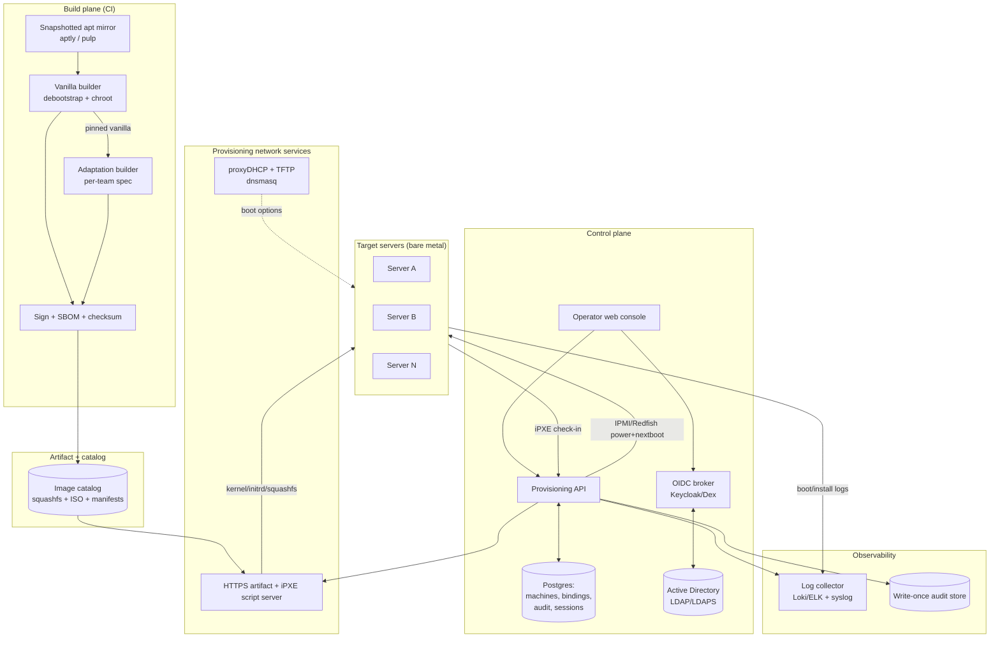
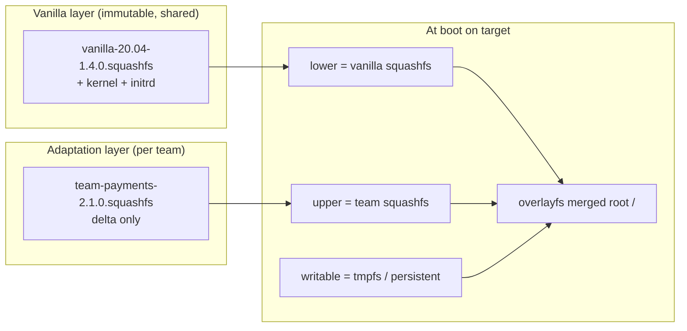
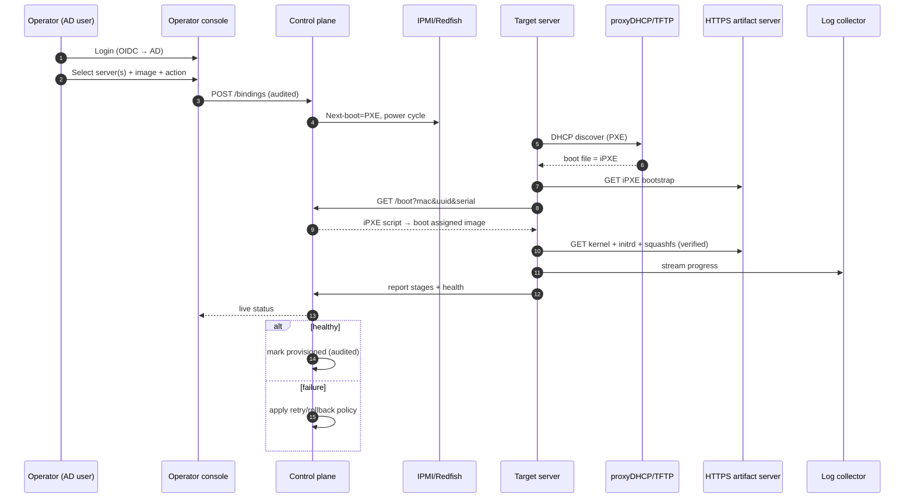
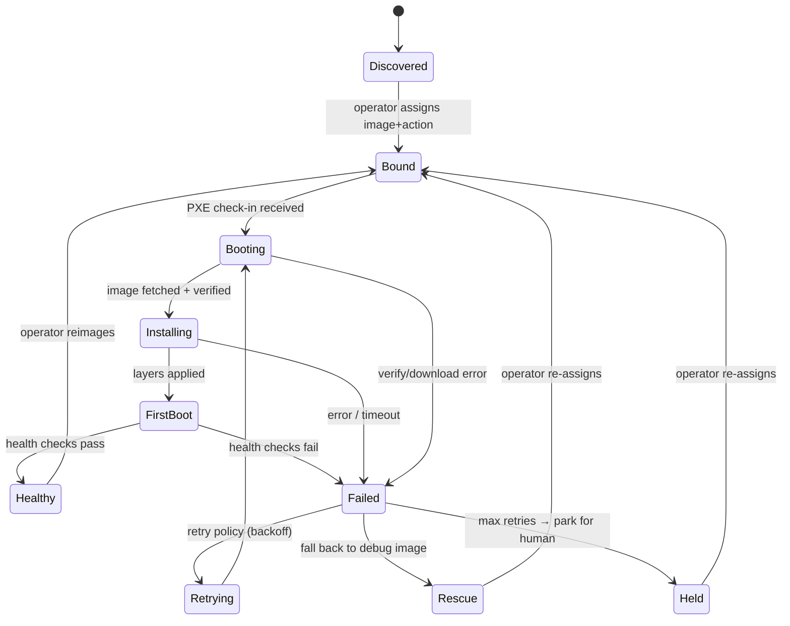

# 02 — Architecture Overview

## 2.1 Component map

## 2.2 Two planes

- **Build plane** — CI only; turns specs into signed images; offline from fleet
- **Run plane** — control plane + network services + fleet; consumes images, never builds
- Separation = auditable (image is a fixed input, provisioning is a recorded transaction)

## 2.3 Two image layers

- Team layer = **delta** over a pinned vanilla version
- Compose via **overlayfs at boot**; also emit merged ISO per team
- Independent versioning/signing → can tell "vanilla broke" vs "team layer broke"

## 2.4 Provisioning flow

## 2.5 Machine state model

## 2.6 Tech choices (defaults — see DECISIONS.md)

- Bootloader — **iPXE** (scriptable, HTTPS, control-plane callback)
- DHCP — **dnsmasq proxyDHCP** (coexists with prod DHCP)
- Base build — **debootstrap + chroot** (live-build optional)
- Layer composition — **overlayfs at boot** + merged ISO
- apt determinism — **aptly/pulp snapshot mirror**
- API — **FastAPI (Python)** or **Go**
- DB — **Postgres**
- UI — **React + WebSocket/SSE**
- AuthN — **Keycloak/Dex (OIDC)** federating AD
- Logs — **Loki + Grafana** (or ELK)
- Remote power — **IPMI / Redfish**
- Signing — **Secure Boot + signed kernels + cosign/GPG**
