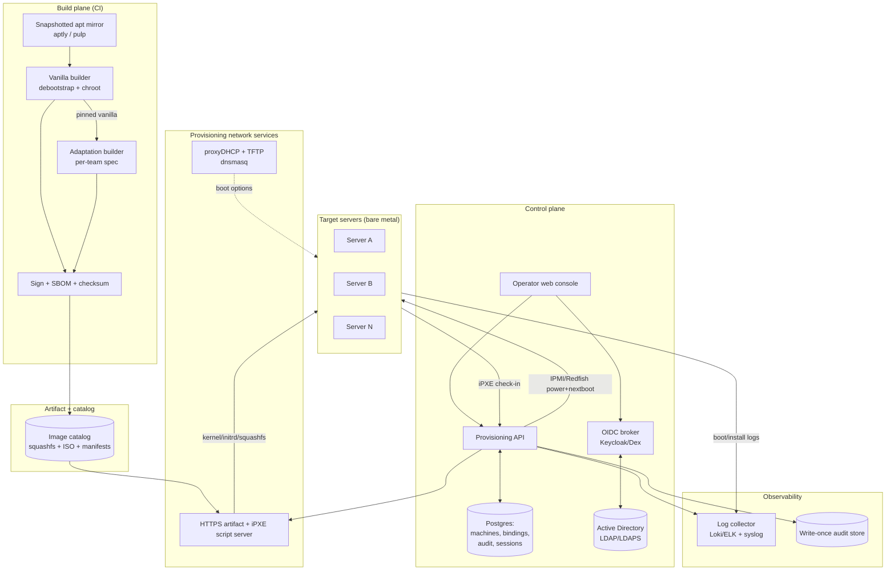
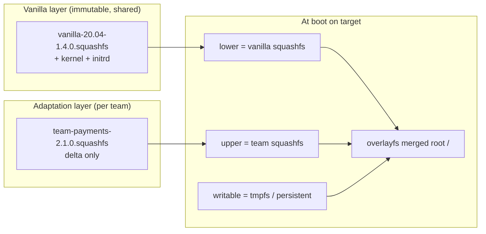
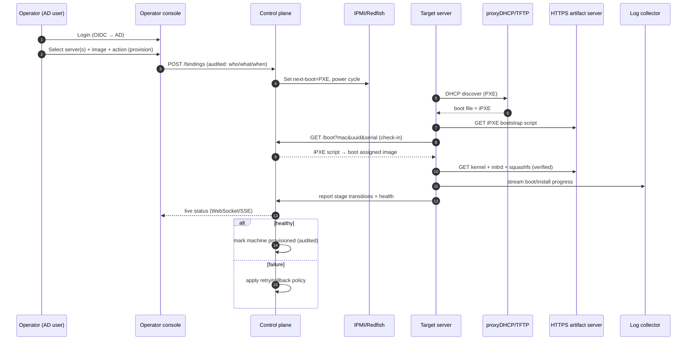
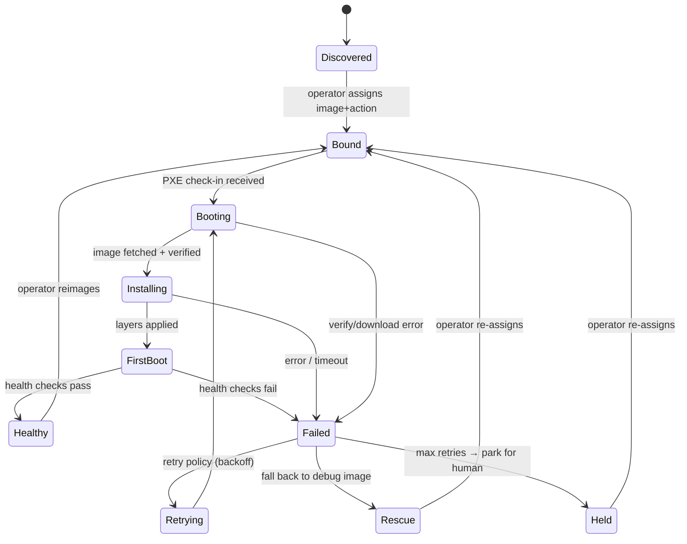

# 02 — Architecture Overview

This is the whole system on one page. Deep dives live in docs 03–09.

## 2.1 Component map

## 2.2 The two planes

- **Build plane** turns source specs into signed image artifacts. It runs in CI,
  is offline from the fleet, and is the *only* thing that produces images.
- **Run plane** (control plane + network services + fleet) consumes those
  artifacts to provision machines. It never builds images; it only selects,
  serves, boots, observes, and records.

Keeping these separate is what makes the system auditable and debuggable: an
image is a fixed, signed input; provisioning is a recorded transaction over it.

## 2.3 The two image layers

The team layer is a **delta** over a pinned vanilla version. They compose with
**overlayfs at boot**, and we *also* emit a fully-merged ISO per team for offline
/ USB use. Independent versioning + signing of each layer is what lets us answer
"is it vanilla or the team layer that broke?" (see [docs/08](docs/08-debuggability-retry.md)).

## 2.4 End-to-end provisioning flow

## 2.5 Machine state model

The control plane tracks each machine through an explicit state machine so the UI,
audit, and retry logic all share one source of truth.

## 2.6 Technology choices (defaults — see DECISIONS.md)

| Concern | Default choice | Why |
| --- | --- | --- |
| Bootloader | **iPXE** (chainloaded from undionly/snponly) | Scriptable, HTTPS boot, menus, control-plane callback |
| DHCP strategy | **dnsmasq proxyDHCP** | Coexists with prod DHCP, no IP takeover |
| Base build | **debootstrap + chroot** (live-build optional) | Reproducible, scriptable, snapshot-friendly |
| Layer composition | **overlayfs at boot** + merged ISO artifact | True two-layer model, debuggable, fast team builds |
| apt determinism | **aptly / pulp snapshot mirror** | Reproducible builds, offline, rollback |
| Control plane API | **FastAPI (Python)** or **Go** | Fast to build, good async + WebSocket support |
| DB | **Postgres** | Relational state + audit, mature |
| Operator UI | **React + WebSocket/SSE** | Real-time fleet status |
| AuthN | **Keycloak/Dex (OIDC) federating AD** | SSO, MFA, keeps AD creds out of the app |
| Logs | **Loki + Grafana** (or ELK) | Centralized, label by machine/session |
| Remote power | **IPMI / Redfish** | Hands-off reimage from the UI |
| Image signing | **Secure Boot + signed kernels + cosign/GPG on artifacts** | Integrity from build to boot |
