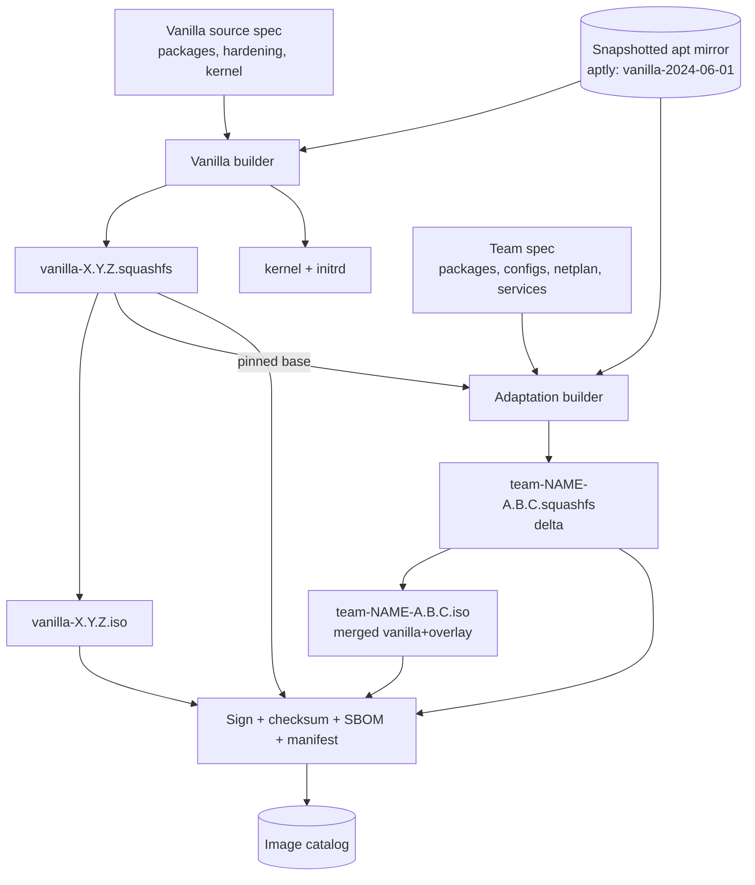
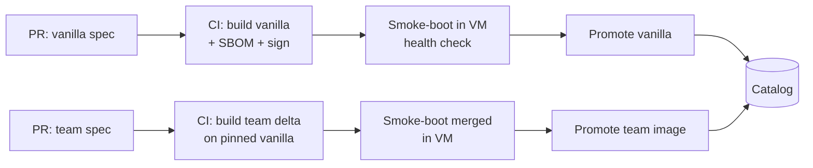

# 03 — Two-Layer ISO Build Pipeline

This is the heart of the "vanilla base + adaptation layer" requirement. The goal:
**reproducible, signed, versioned** images where the two layers are independent
artifacts that compose cleanly — so they can be built, diffed, and debugged
separately.

## 3.1 Layering model



### Why squashfs layers, not "rebuild a full ISO per team"

The naive approach (unpack vanilla, modify, repack a whole new ISO per team) works
but is slow and opaque — every team carries a full copy and you can't tell what the
team actually changed. Instead:

- **Vanilla** is built once → one immutable `squashfs`.
- **Adaptation** is computed as a **delta squashfs** (only the files the team adds
  or changes), built by chrooting into the vanilla rootfs, applying the team spec,
  and capturing the diff.
- At boot, the target stacks `team` (upper) over `vanilla` (lower) with **overlayfs**,
  plus a writable layer. One vanilla on disk/HTTP, many small team deltas.
- For offline/USB needs we **also** emit a merged `team-*.iso` (vanilla+overlay
  flattened) — same inputs, just packaged whole.

Benefits: tiny team builds, a literal file-level diff of "what the team changed,"
independent signing/versioning, and the ability to boot vanilla-only to bisect bugs.

## 3.2 Vanilla builder (Stage A)

Reproducible base build. Recommended: `debootstrap` + a chroot provisioning script
(kept declarative). `live-build` is a viable alternative if the team prefers it.

Pipeline steps:
1. **Pin inputs**: select an apt mirror **snapshot** (e.g. aptly publish
   `vanilla-2024-06-01`) and pin the kernel/package versions. No live internet apt.
2. `debootstrap focal` into a build root against the snapshot.
3. Chroot provisioning (idempotent script or Ansible in chroot):
   - base packages, hardening (CIS-ish baseline), common tooling, the
     **provisioning agent** (reports stages/health to the control plane),
     serial console + persistent logging config, overlayfs/casper boot support.
4. Generate `initrd` with the overlay-boot logic (mount lower=vanilla,
   upper=team, writable layer).
5. `mksquashfs` the rootfs → `vanilla-X.Y.Z.squashfs`.
6. Assemble a bootable **ISO** (GRUB/isolinux + kernel + initrd + squashfs).
7. Emit **manifest** (exact package list = SBOM), **checksums**, and **signature**.

Versioning: `vanilla-<ubuntu>-<MAJOR.MINOR.PATCH>` (e.g. `vanilla-20.04-1.4.0`).
The version bumps on any input change; the build is reproducible from the manifest.

## 3.3 Adaptation builder (Stage B, per team)

Input = a **pinned vanilla version** + a **team spec**. The spec is declarative and
lives in version control per team:

```yaml
# teams/payments/adaptation.yaml  (illustrative)
team: payments
base_vanilla: "vanilla-20.04-1.4.0"     # pinned, signed base
packages:
  - postgresql-client
  - team-payments-agent
files:
  - src: files/netplan-payments.yaml
    dst: /etc/netplan/60-payments.yaml
network:
  # Non-secret defaults only; real IPs/secrets injected at provision time (see 3.6)
  vlan: 142
  search_domain: payments.corp.example
services:
  enable: [team-payments-agent]
post_install:
  - /opt/payments/firstboot-check.sh
```

Steps:
1. Verify and unpack the **signed** base vanilla squashfs.
2. `chroot` and apply the spec (install packages from the **same snapshot**,
   drop files, configure netplan/services) via Ansible-in-chroot or a runner.
3. Capture the **delta** → `mksquashfs` only changed paths → `team-NAME-A.B.C.squashfs`.
4. Optionally flatten → merged `team-NAME-A.B.C.iso`.
5. Manifest records **`base_vanilla` provenance** + the team delta SBOM; sign + checksum.

Versioning: `team-<name>-<MAJOR.MINOR.PATCH>`, and the manifest always names the
exact vanilla it was built on. That provenance link is what powers
"boot the previous good team version" and "boot vanilla-only" debugging.

## 3.4 Reproducibility & determinism (NFR1)

- **Snapshotted apt** (aptly/pulp): builds pull from a frozen mirror, never the
  live internet. Rebuilding an old version pulls its original snapshot.
- **Pinned versions** in the manifest; `SOURCE_DATE_EPOCH` for deterministic timestamps.
- Build runs in CI in a clean container; the resulting image hash is recorded.
  Same inputs → same hash (verifiable).

## 3.5 Image catalog

A registry (object store + Postgres metadata, or an OCI registry) holding, per version:
`squashfs`, `ISO`, `kernel/initrd`, `manifest/SBOM`, `checksum`, `signature`, and
**lifecycle state** (`draft → tested → promoted → deprecated`). The control plane
only lets operators bind **promoted** images by default (canary/test images are
opt-in). This is also the rollback source.

## 3.6 Secrets & per-machine network settings (important)

Per-team **IP settings and secrets must not be baked into a shared image**.
Two tiers:
- **Non-secret team defaults** (VLAN, search domain, package set) → in the team
  layer image (fine to share within the team).
- **Per-machine / secret values** (static IPs, credentials, certs) → injected at
  **provision time** from a secrets store (Vault) / IPAM, delivered over the
  authenticated channel and written by the provisioning agent on first boot.

This keeps images cacheable and signable while still giving each machine its real
identity. See [docs/09](docs/09-security.md).

## 3.7 CI pipeline shape



Every build smoke-boots in a VM (qemu) and runs the same first-boot health check
the real machines use — so a broken image is caught in CI, not on the floor.

## 3.8 Repository layout (proposed)

```
build/
  vanilla/            # vanilla spec, chroot scripts, initrd overlay logic
  adaptation/         # shared adaptation builder/runner
teams/
  payments/adaptation.yaml
  search/adaptation.yaml
mirror/               # aptly/pulp snapshot config
ci/                   # pipeline definitions
```
