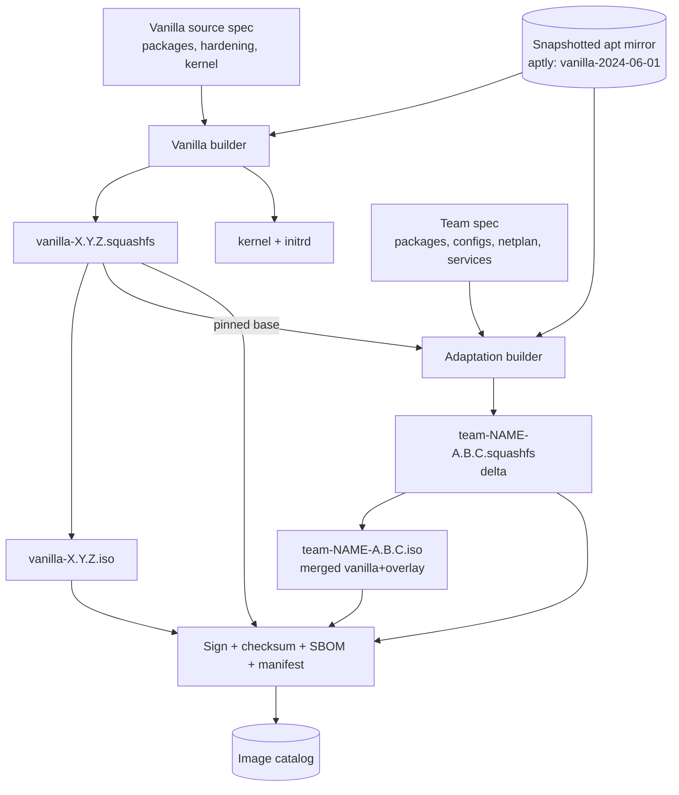
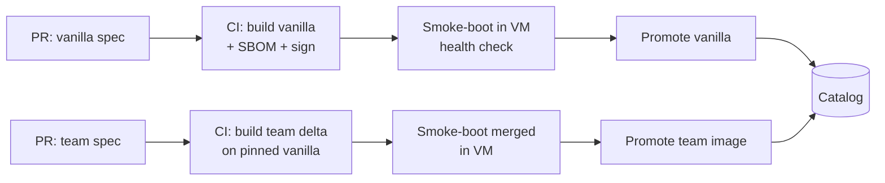

# 03 — Two-Layer ISO Build Pipeline

## 3.1 Layering model



### Why squashfs layers, not full ISO rebuild per team
- Vanilla built once → one immutable squashfs
- Adaptation = **delta squashfs** (only files the team adds/changes)
- At boot: stack team (upper) over vanilla (lower) with overlayfs + writable layer
- Also emit a merged `team-*.iso` for offline/USB
- Benefits: tiny team builds, literal file diff of team changes, independent signing, vanilla-only debugging

## 3.2 Vanilla builder (Stage A)

- Tool: **debootstrap + chroot** (live-build optional)
- Steps:
  - Pin apt mirror **snapshot** + kernel/package versions (no live-internet apt)
  - `debootstrap focal` into build root
  - Chroot provisioning: base packages, hardening (CIS-ish), tooling, **provisioning agent**, serial console + persistent logging, overlay-boot support
  - Build `initrd` with overlay-boot logic
  - `mksquashfs` → `vanilla-X.Y.Z.squashfs`
  - Assemble bootable **ISO** (GRUB/isolinux + kernel + initrd + squashfs)
  - Emit manifest (SBOM), checksums, signature
- Versioning: `vanilla-<ubuntu>-<MAJOR.MINOR.PATCH>` (e.g. `vanilla-20.04-1.4.0`)

## 3.3 Adaptation builder (Stage B, per team)

- Input = pinned vanilla version + declarative **team spec** (in version control)

```yaml
# teams/payments/adaptation.yaml  (illustrative)
team: payments
base_vanilla: "vanilla-20.04-1.4.0"
packages:
  - postgresql-client
  - team-payments-agent
files:
  - src: files/netplan-payments.yaml
    dst: /etc/netplan/60-payments.yaml
network:
  vlan: 142                       # non-secret defaults only
  search_domain: payments.corp.example
services:
  enable: [team-payments-agent]
post_install:
  - /opt/payments/firstboot-check.sh
```

- Steps:
  - Verify + unpack signed vanilla squashfs
  - Chroot, apply spec (packages from same snapshot, files, netplan, services)
  - Capture **delta** → `mksquashfs` → `team-NAME-A.B.C.squashfs`
  - Optionally flatten → merged ISO
  - Manifest records `base_vanilla` provenance + team SBOM; sign + checksum
- Versioning: `team-<name>-<MAJOR.MINOR.PATCH>`, always names exact vanilla used

## 3.4 Reproducibility (NFR1)

- Snapshotted apt (aptly/pulp), never live internet
- Pinned versions in manifest; `SOURCE_DATE_EPOCH` for deterministic timestamps
- Clean CI container; image hash recorded → same inputs, same hash

## 3.5 Image catalog

- Stores per version: squashfs, ISO, kernel/initrd, manifest/SBOM, checksum, signature
- Lifecycle: `draft → tested → promoted → deprecated`
- Operators bind **promoted** images by default; also the rollback source

## 3.6 Secrets & per-machine network

- **No secrets in shared images**
- Non-secret team defaults (VLAN, domain, packages) → in team image
- Per-machine/secret values (static IP, creds, certs) → injected at **provision time** from Vault/IPAM, written by agent on first boot

## 3.7 CI pipeline



- Every build smoke-boots in qemu + runs the same first-boot health check as real machines

## 3.8 Repository layout

```
build/
  vanilla/            # vanilla spec, chroot scripts, initrd overlay logic
  adaptation/         # shared adaptation builder/runner
teams/
  payments/adaptation.yaml
  search/adaptation.yaml
mirror/               # aptly/pulp snapshot config
ci/                   # pipeline definitions
```
