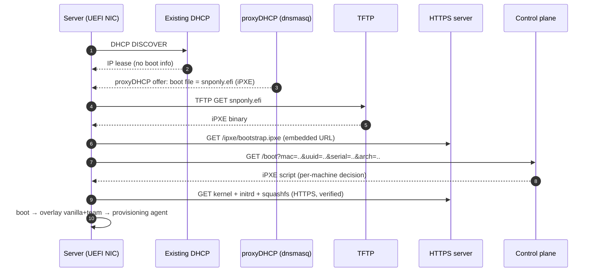

# 04 — PXE Boot Infrastructure

How a bare server goes from power-on to running the right image, without disrupting
existing network services, and with the control plane in charge of *what* it boots.

## 4.1 Boot chain



### Why this chain

- **proxyDHCP** (dnsmasq in `--dhcp-range=...,proxy` mode) supplies *only* the boot
  filename/next-server. The production DHCP still hands out IPs. No takeover, no
  disruption (NFR6) — the single most important "don't break the network" decision.
- **TFTP** is used only for the tiny iPXE binary. Everything big moves to HTTP(S).
- **iPXE** is the brains on the client side: it can speak **HTTPS**, render menus,
  retry, and — crucially — **call back to the control plane** so the *server* decides
  what this specific machine boots. That callback is what wires the UI to real boots.
- **UEFI** first (`snponly.efi` / `ipxe.efi`); legacy BIOS supported via `undionly.kpxe`
  for older hardware. Secure Boot uses a signed shim → signed iPXE → signed kernel.

## 4.2 Control-plane boot decision

The embedded iPXE bootstrap is intentionally dumb; it just chainloads from the API:

```ipxe
#!ipxe
# bootstrap.ipxe (embedded in the iPXE binary or served first)
dhcp
chain https://control.prov.example/boot?mac=${net0/mac}&uuid=${uuid}&serial=${serial}&arch=${buildarch} || goto fail
:fail
echo Boot decision failed; dropping to rescue menu
chain https://control.prov.example/rescue.ipxe
```

The control plane looks the machine up and returns a script. Examples:

**Provision an assigned team image:**
```ipxe
#!ipxe
kernel https://artifacts.prov.example/vanilla-20.04-1.4.0/vmlinuz \
  boot=overlay \
  vanilla=https://artifacts.prov.example/vanilla-20.04-1.4.0/root.squashfs \
  overlay=https://artifacts.prov.example/team-payments-2.1.0/root.squashfs \
  session=9f3c... console=ttyS0,115200 console=tty0 \
  control=https://control.prov.example
initrd https://artifacts.prov.example/vanilla-20.04-1.4.0/initrd.img
boot
```

**No assignment / already healthy → boot local disk** (so a reimaged box doesn't
loop back into PXE):
```ipxe
#!ipxe
sanboot --no-describe --drive 0x80 || exit
```

**Failed + retry budget left → re-attempt; exhausted → rescue** (see [docs/08](docs/08-debuggability-retry.md)).

The decision is data-driven from the `machines`/`bindings` tables, so the **operator
UI changes one row** and the next network boot does the right thing.

## 4.3 Artifact serving

- **HTTPS** server (nginx/caddy) fronting the image catalog. Big files (squashfs,
  kernel, initrd) only — fast, cacheable, resumable, integrity-checked.
- iPXE verifies artifacts before executing: **HTTPS with pinned CA** + the kernel
  command line carries the squashfs **checksum**; the initrd refuses a mismatch.
  With Secure Boot, the kernel itself is signature-verified by shim.
- Optional local HTTP **caches** per rack/switch for large fleets.

## 4.4 initrd overlay boot logic

The vanilla initrd contains the logic that realizes the two-layer model on the
target (conceptually):

1. Bring up networking (from PXE/DHCP).
2. Fetch + verify `vanilla` squashfs (lower) and `overlay` team squashfs (upper).
3. Mount **overlayfs**: `lowerdir=vanilla,upperdir=team` (read-only merge) with a
   writable `tmpfs` (or persistent partition) on top → that becomes `/`.
4. Start the **provisioning agent**, which:
   - pulls per-machine secrets/IP from the control plane (authenticated),
   - applies `netplan`/identity, runs `post_install`,
   - streams stage transitions + logs to the collector,
   - runs the **first-boot health check** and reports `Healthy`/`Failed`.

Two run modes (operator-selectable per binding):
- **Live/ephemeral**: run entirely from squashfs+tmpfs (nothing written to disk) —
  great for diskless/appliance use and for debugging.
- **Install-to-disk**: the agent writes the merged image + identity to local disk and
  flips next-boot to local (the long-term steady state for most servers).

## 4.5 Remote power & next-boot (hands-off reimage)

To reimage without walking to the rack, the control plane drives **IPMI/Redfish**:
set next-boot = PXE (one-shot), power cycle, and after success let it boot local disk.
Machines without BMC fall back to manual "set this machine to PXE then reboot," which
the UI surfaces as an instruction. (See DECISIONS.md — confirm BMC availability.)

## 4.6 Network services footprint

| Service | Software | Notes |
| --- | --- | --- |
| proxyDHCP + TFTP | dnsmasq | One per broadcast domain (or DHCP relay/IP-helper) |
| HTTPS artifacts | nginx/caddy + catalog | Can be HA behind a VIP |
| Boot API | control plane | Stateless behind LB; state in Postgres |
| Time | NTP | Needed for TLS + audit timestamps |

DHCP option 175 (iPXE) / user-class is used so iPXE-stage requests get the script
URL while the first PXE request gets the iPXE binary — avoiding a chainload loop.
