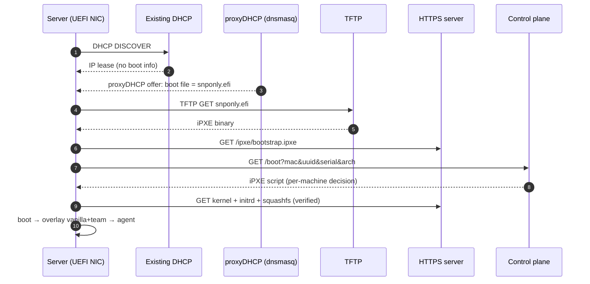

# 04 — PXE Boot Infrastructure

## 4.1 Boot chain



### Why this chain
- **proxyDHCP** — supplies only boot file; prod DHCP still hands out IPs; no disruption
- **TFTP** — only for the tiny iPXE binary; big files over HTTP
- **iPXE** — HTTPS, menus, retry, **callback to control plane** so server decides the boot
- **UEFI first** (`snponly.efi`); legacy BIOS via `undionly.kpxe`; Secure Boot = signed shim → iPXE → kernel

## 4.2 Control-plane boot decision

- Embedded bootstrap just chainloads from the API:

```ipxe
#!ipxe
dhcp
chain https://control.prov.example/boot?mac=${net0/mac}&uuid=${uuid}&serial=${serial}&arch=${buildarch} || goto fail
:fail
chain https://control.prov.example/rescue.ipxe
```

- **Provision assigned team image:**

```ipxe
#!ipxe
kernel https://artifacts.prov.example/vanilla-20.04-1.4.0/vmlinuz \
  boot=overlay \
  vanilla=https://artifacts.prov.example/vanilla-20.04-1.4.0/root.squashfs \
  overlay=https://artifacts.prov.example/team-payments-2.1.0/root.squashfs \
  session=9f3c... console=ttyS0,115200 console=tty0 \
  control=https://control.prov.example
initrd https://artifacts.prov.example/vanilla-20.04-1.4.0/initrd.img
boot
```

- **No assignment / healthy → boot local disk** (avoid PXE loop): `sanboot --drive 0x80`
- **Failed + budget left → retry; exhausted → rescue** (see docs/08)
- Decision is data-driven from `machines`/`bindings` → UI changes one row, next boot does the right thing

## 4.3 Artifact serving

- HTTPS (nginx/caddy) fronting catalog; big files only (fast, resumable, integrity-checked)
- iPXE verifies before executing: HTTPS + pinned CA + squashfs checksum on kernel cmdline
- Secure Boot = kernel signature-verified by shim
- Optional per-rack HTTP caches for large fleets

## 4.4 initrd overlay boot logic

- Bring up networking from PXE/DHCP
- Fetch + verify vanilla (lower) and team (upper) squashfs
- Mount overlayfs: `lowerdir=vanilla, upperdir=team` + writable tmpfs/partition → `/`
- Start provisioning agent:
  - pulls per-machine secrets/IP (authenticated)
  - applies netplan/identity, runs `post_install`
  - streams stages + logs
  - runs first-boot health check → reports Healthy/Failed
- Two run modes (operator picks per binding):
  - **Live/ephemeral** — squashfs + tmpfs, nothing on disk (diskless/debug)
  - **Install-to-disk** — agent writes merged image + identity to disk, flips next-boot to local

## 4.5 Remote power & next-boot

- Control plane drives **IPMI/Redfish**: next-boot=PXE (one-shot), power cycle, then local on success
- No BMC → UI shows "set PXE + reboot manually" instruction

## 4.6 Network services footprint

- proxyDHCP + TFTP — **dnsmasq**, one per broadcast domain (or DHCP relay)
- HTTPS artifacts — nginx/caddy + catalog, HA behind VIP
- Boot API — control plane, stateless behind LB, state in Postgres
- Time — NTP (needed for TLS + audit timestamps)
- DHCP option 175 / user-class avoids chainload loop (iPXE-stage gets script, first PXE gets binary)
