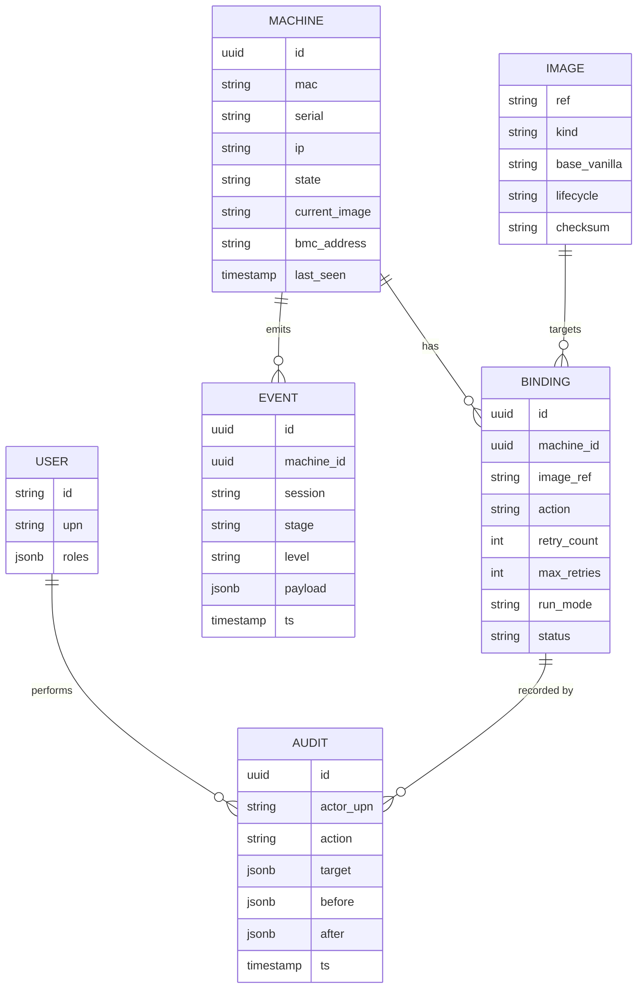
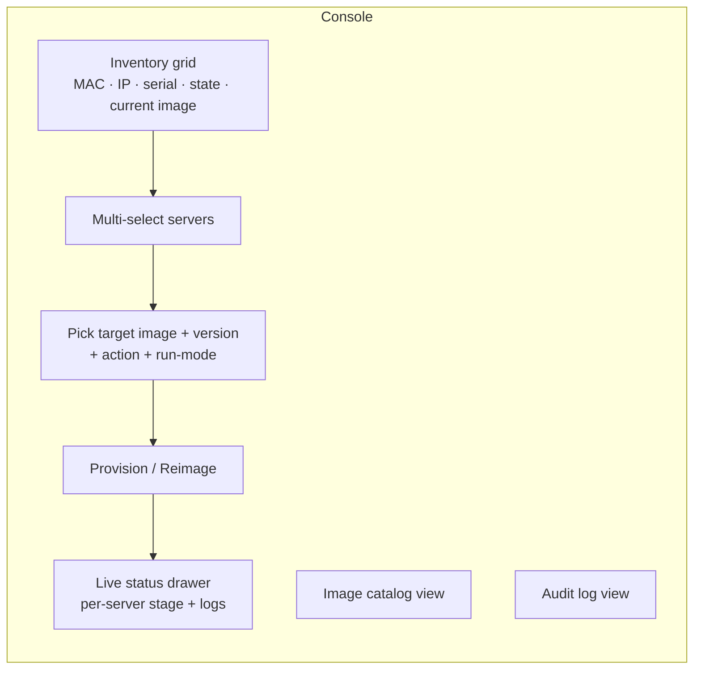

# 05 — Control Plane & Operator UI

## 5.1 Responsibilities

- Inventory of machines, state, last-imaged version
- Bindings: machine → image + version + action (provision/reimage/retry/debug/local)
- Boot decisioning: answer iPXE check-ins
- Lifecycle/health: ingest stage transitions, drive state machine, retry/rollback
- Catalog: list image versions + lifecycle
- AuthN/Z: OIDC session, RBAC per action
- Audit: append-only record of actions + transitions

## 5.2 Data model

## 5.3 API surface

- `GET /boot` — iPXE check-in → iPXE script — *machine auth*
- `POST /machines/{id}/events` — report stage/log/health — *machine session token*
- `GET /machines` — inventory — *operator*
- `POST /bindings` — bind machine(s) → image + action — *operator (RBAC)*
- `POST /bindings/{id}/retry` — force retry — *operator*
- `POST /machines/{id}/rescue` — send to rescue — *operator*
- `POST /machines/{id}/power` — IPMI/Redfish power + next-boot — *operator (RBAC)*
- `GET /images` — catalog — *operator*
- `POST /images/{ref}/promote` — promote/deprecate — *admin*
- `GET /audit` — audit trail — *auditor/admin*
- `GET /stream` — WebSocket/SSE live status — *operator*
- Machine endpoints authed by short-lived session token tied to the binding

## 5.4 Operator console

- **Inventory screen**
  - Filterable grid: MAC, IP, serial/asset, state (color-coded), current image, last seen, BMC
  - Sources merged: DHCP leases, iPXE check-ins, optional ARP/LLDP; new = `Discovered`
- **Workflow: select → choose → go**
  - Select one/many (checkbox / shift-select / "all in rack")
  - Pick target image (team+version / vanilla / rescue); defaults to latest promoted; older selectable for rollback
  - Pick action (provision/reimage) + run-mode (live vs install-to-disk)
  - Confirm → writes bindings (audited) + power-cycles via BMC
- **Live status drawer**
  - Per-server progress through state machine + inline log tail
  - Buttons: Retry, Rollback to previous, Send to rescue, Open console (SoL)
- **Supporting screens**: image catalog (versions + lifecycle + promote), audit log (search by operator/machine/image/time)

## 5.5 Real-time

- Machines POST events → control plane fans out over WebSocket/SSE
- Same events drive state machine + audit + logs (one stream, three consumers)

## 5.6 Deployment

- Stateless API + UI behind LB; state in Postgres; artifacts on HTTPS server
- Containerized (compose for pilot, Kubernetes optional later)
- Runs on provisioning network with controlled egress to AD + log stack
