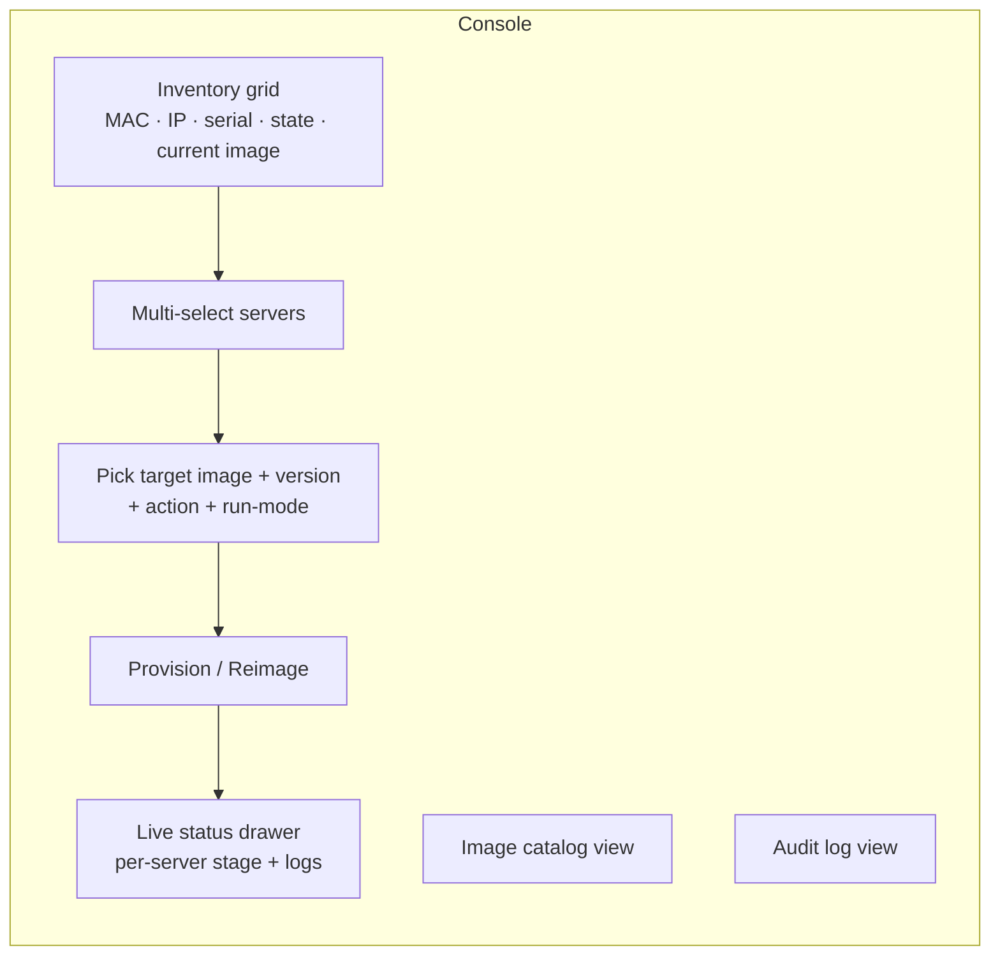

# 05 — Control Plane & Operator UI

The control plane is the brain; the UI is the "simple UI to choose servers on the
network" from the request. Together they turn an operator's intent into boot
decisions and record everything.

## 5.1 Responsibilities

- **Inventory** of machines (discovered + known), their state, and last-imaged version.
- **Bindings**: map a machine → desired image + version + action (provision / reimage
  / retry / debug / boot-local).
- **Boot decisioning**: answer iPXE check-ins with the right script.
- **Lifecycle/health**: ingest machine stage transitions, drive the state machine,
  apply retry/rollback.
- **Catalog**: list image versions and their lifecycle state.
- **AuthN/Z**: OIDC session, RBAC on every action.
- **Audit**: append-only record of every operator action and machine transition.

## 5.2 Data model (core tables)

```mermaid
erDiagram
  MACHINE ||--o{ BINDING : has
  MACHINE ||--o{ EVENT : emits
  IMAGE ||--o{ BINDING : targets
  USER ||--o{ AUDIT : performs
  BINDING ||--o{ AUDIT : "recorded by"

  MACHINE {
    uuid id
    string mac
    string serial
    string ip
    string state          "Discovered..Healthy"
    string current_image
    string bmc_address
    timestamp last_seen
  }
  BINDING {
    uuid id
    uuid machine_id
    string image_ref       "team-payments-2.1.0"
    string action          "provision|reimage|retry|debug|local"
    int retry_count
    int max_retries
    string run_mode        "live|install"
    string status
  }
  IMAGE {
    string ref
    string kind            "vanilla|team"
    string base_vanilla
    string lifecycle       "draft|tested|promoted|deprecated"
    string checksum
  }
  EVENT {
    uuid id
    uuid machine_id
    string session
    string stage
    string level
    jsonb payload
    timestamp ts
  }
  USER {
    string id
    string upn             "AD userPrincipalName"
    jsonb roles
  }
  AUDIT {
    uuid id
    string actor_upn
    string action
    jsonb target
    jsonb before
    jsonb after
    timestamp ts
  }
```

## 5.3 API surface (illustrative)

| Method/Path | Purpose | Auth |
| --- | --- | --- |
| `GET /boot` | iPXE check-in → returns iPXE script | machine (network + signed token) |
| `POST /machines/{id}/events` | Machine reports stage/log/health | machine session token |
| `GET /machines` | Inventory (filter by state/team) | operator |
| `POST /bindings` | Bind machine(s) → image + action | operator (RBAC) |
| `POST /bindings/{id}/retry` | Force retry | operator |
| `POST /machines/{id}/rescue` | Send to rescue/debug | operator |
| `POST /machines/{id}/power` | IPMI/Redfish power + next-boot | operator (RBAC) |
| `GET /images` | Image catalog | operator |
| `POST /images/{ref}/promote` | Promote/deprecate | admin |
| `GET /audit` | Query audit trail | auditor/admin |
| `GET /stream` | WebSocket/SSE live status | operator |

`GET /boot` and `/events` are the machine-facing endpoints; everything else is
operator-facing behind OIDC. Machine endpoints are authenticated by a short-lived
**session token** minted into the iPXE script and tied to the binding (so a machine
can only report against its own active session).

## 5.4 Operator console (the "simple UI")

Primary screen — **Inventory**:
- A filterable/sortable grid of machines on the provisioning network: MAC, IP,
  serial/asset tag, current state (color-coded against the state machine), current
  image+version, last seen, BMC presence.
- Discovery sources merged: DHCP leases, iPXE check-ins, optional ARP/LLDP scan.
  New machines appear as `Discovered`.

Core workflow — **select → choose → go**:
1. Select one or many servers (checkboxes / shift-select / "select all in rack").
2. Choose **target image** (team + version, or vanilla, or rescue) — defaults to
   latest **promoted** for that team; older promoted versions selectable for rollback.
3. Choose **action** (provision / reimage) and **run-mode** (live vs install-to-disk).
4. Confirm → control plane writes bindings (audited) and, where BMC exists, power-cycles.

Live feedback — **status drawer**:
- Per-server progress through the state machine, with the streamed boot/install log
  tail inline (so failures are visible immediately — directly addresses the
  "everything is a black box" pain point).
- Buttons per server: **Retry**, **Rollback to previous**, **Send to rescue**,
  **Open console** (serial-over-LAN where available).

Supporting screens: **Image catalog** (versions + lifecycle + promote/deprecate),
**Audit log** (searchable by operator/machine/image/time).

## 5.5 Real-time

Machines POST events to `/machines/{id}/events`; the control plane fans them out over
WebSocket/SSE to subscribed UI clients. The same events drive the state machine and
the audit/observability pipelines — one event stream, three consumers.

## 5.6 Deployment

Stateless API + UI behind a load balancer; state in Postgres; artifacts on the HTTPS
server; everything containerized (compose for pilot, Kubernetes optional later).
Runs on the provisioning network with a controlled egress to AD and the log stack.
