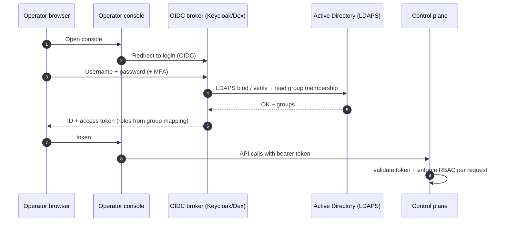

# 06 — Authentication & Authorization (Windows AD / LDAP)

The request: "how do I log into this using LDAP — basically Windows LDAP." Operators
log into the console with their **Active Directory** identity, and AD group
membership decides what they can do.

## 6.1 Recommended approach: OIDC broker federating AD

Rather than have the control plane bind to LDAP directly, front it with an **OIDC
broker** (Keycloak or Dex) that federates Active Directory.

Why the broker (vs raw LDAP bind in the app):
- **AD credentials never touch our app** — only the broker talks LDAPS to AD.
- Free **SSO, MFA, account lockout, password policy** — inherited from AD/broker.
- Standard **OIDC tokens** → clean RBAC, short-lived sessions, easy service-to-service.
- Group→role mapping is centralized and auditable.

A **direct LDAPS bind** in the control plane is the simpler fallback if standing up a
broker is unwanted — supported, but loses SSO/MFA niceties. See DECISIONS.md.

### AD connection specifics
- **LDAPS (636)** or **StartTLS (389)** only — never plaintext bind.
- Bind via `userPrincipalName` (`user@corp.example`) or `sAMAccountName`.
- A read-only **service account** reads group membership (`memberOf`, nested groups
  via `LDAP_MATCHING_RULE_IN_CHAIN`).
- Configurable base DN, user/group filters, and the CA cert for the AD LDAPS endpoint.

## 6.2 Roles & RBAC

AD security groups map to application roles:

| AD group (example) | App role | Capabilities |
| --- | --- | --- |
| `PROV-Admins` | `admin` | Everything incl. promote/deprecate images, manage policy |
| `PROV-Operators` | `operator` | Provision/reimage/retry/rescue any team's machines |
| `PROV-Team-Payments` | `operator:payments` | Provision/reimage **only** payments machines + images |
| `PROV-Auditors` | `auditor` | Read-only: inventory + audit log, no actions |

- **Team-scoped operators** are important: a team can drive *its* servers and images
  without touching another team's. Enforced server-side on every `/bindings` and
  `/power` call by matching the binding's team against the token's roles.
- RBAC is enforced in the **control plane**, not just the UI (the UI only hides what
  the API also forbids).

## 6.3 Machine (non-human) authentication

Distinct from operator auth: target machines authenticate to the control plane with a
short-lived **session token** embedded in their iPXE script and bound to the active
binding. It authorizes only `GET /boot` continuation and `POST /events` for that
machine/session — so a booting machine can report progress and fetch its secrets, but
nothing else. Tokens expire when the session ends.

## 6.4 Target-OS domain join (separate, optional)

Note the difference between *operator login to the console* (above) and *whether the
provisioned servers themselves join AD*. If teams want their servers to allow AD
logins (via **SSSD/realmd**), that is configured in the **adaptation layer**
([docs/03](docs/03-iso-build-pipeline.md)) per team, with the join credential
delivered as a provision-time secret. Called out so the two "LDAP" concerns don't get
conflated.

## 6.5 Auth-related auditing

Every authenticated action carries the operator's **AD UPN** into the audit record
([docs/07](docs/07-logging-auditing.md)): login/logout, binding create/change, power
actions, image promotion. Failed logins and RBAC denials are logged too.
