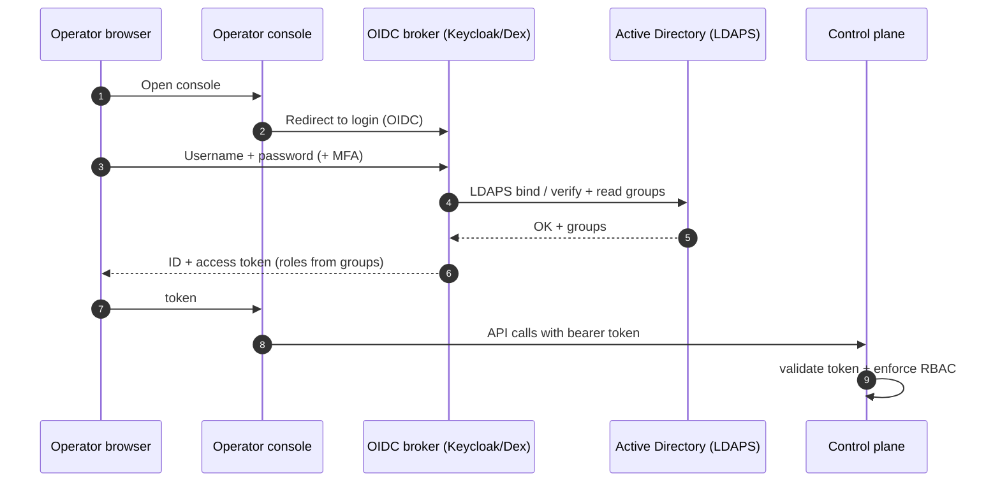

# 06 — Authentication & Authorization (Windows AD / LDAP)

## 6.1 Recommended: OIDC broker federating AD

- Why the broker (vs raw LDAP bind in app):
  - AD credentials never touch our app
  - Free SSO, MFA, lockout, password policy
  - Standard OIDC tokens → clean RBAC, short sessions
  - Group→role mapping centralized + auditable
- Fallback: direct LDAPS bind in control plane (simpler, loses SSO/MFA) — see DECISIONS.md

### AD connection specifics
- LDAPS (636) or StartTLS (389) only — never plaintext
- Bind via `userPrincipalName` or `sAMAccountName`
- Read-only service account reads groups (`memberOf`, nested via `LDAP_MATCHING_RULE_IN_CHAIN`)
- Configurable base DN, user/group filters, LDAPS CA cert

## 6.2 Roles & RBAC

- `PROV-Admins` → **admin** — everything incl. promote/deprecate, policy
- `PROV-Operators` → **operator** — provision/reimage/retry/rescue any team
- `PROV-Team-Payments` → **operator:payments** — only payments machines + images
- `PROV-Auditors` → **auditor** — read-only inventory + audit
- Team-scoped operators enforced server-side on every `/bindings` + `/power` call
- RBAC enforced in control plane, not just UI

## 6.3 Machine (non-human) auth

- Targets authenticate with short-lived **session token** in their iPXE script, bound to the active binding
- Authorizes only `GET /boot` continuation + `POST /events` for that machine/session
- Token expires when session ends

## 6.4 Target-OS domain join (separate, optional)

- Distinct from operator login
- If teams want servers to allow AD logins (SSSD/realmd), configure in the **adaptation layer**
- Join credential delivered as a provision-time secret

## 6.5 Auth auditing

- Every action carries operator **AD UPN** into audit: login/logout, binding changes, power, promotion
- Failed logins + RBAC denials logged
