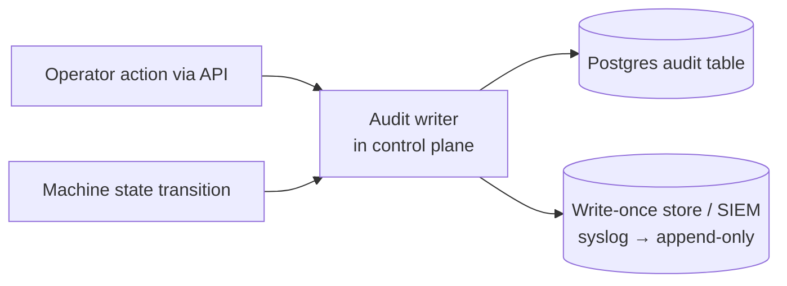
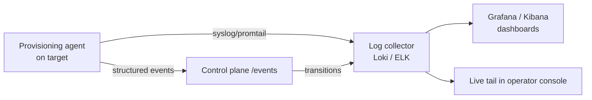

# 07 — Logging & Auditing

Two distinct concerns, often conflated:

- **Audit** — *who did what* (compliance, security, accountability). Immutable,
  identity-bound, low-volume, long retention.
- **Observability logs** — *what happened on the machines and in the build*
  (debugging, monitoring). High-volume, shorter retention, queryable.

Both are first-class because the request explicitly calls out "logging or auditing"
and the "black box" problem.

## 7.1 Audit trail

Every audited record captures: **actor** (AD UPN, or `system`/`machine:<id>`),
**action**, **target** (machine ids, image ref), **before/after** state, **timestamp**
(NTP-synced), **request id**, and **source IP**. Audited events include:

- Login / logout / failed login / RBAC denial.
- Binding create/update/delete (which servers, which image+version, which action).
- Power / next-boot actions (IPMI/Redfish).
- Retry / rollback / send-to-rescue.
- Image promote / deprecate.
- Machine lifecycle transitions (`Booting → Installing → Healthy/Failed`).

Properties: **append-only** (no in-place edit/delete via the app), mirrored to a
**write-once store or SIEM** so it survives even DB compromise, and **queryable** in
the UI by operator/machine/image/time.

## 7.2 Provisioning logs (the anti-"black box" piece)

Each booting machine streams logs to a central collector, tagged so failures are
findable without touching the machine:

- Logs are labeled with `machine_id`, `session`, `image_ref`, `stage`, so you can pull
  exactly "payments-2.1.0 on server SN1234, session 9f3c, install stage."
- **Logs survive reboot**: shipped off-box in real time (and, in install mode, also
  written to a persistent partition) so a failure that ends in a reboot doesn't erase
  the evidence — the #1 reason provisioning feels undebuggable today.
- **Serial console** output is captured too (`console=ttyS0`), and serial-over-LAN is
  exposed in the UI where the BMC supports it.
- Stage transitions are both events (drive the state machine/UI) and log lines.

## 7.3 Build logs & provenance

Per image version the catalog retains: full **CI build log**, the **manifest/SBOM**
(exact packages), the **base-vanilla provenance** for team images, checksum, and
signature. So "what's actually in this image, and how was it built" is always
answerable — essential for debugging a bad image and for security response.

## 7.4 Centralized stack

| Layer | Default | Alt |
| --- | --- | --- |
| Log transport | promtail / rsyslog | filebeat |
| Log store/query | Loki + Grafana | ELK (Elasticsearch+Kibana) |
| Metrics | Prometheus + Grafana | — |
| Audit mirror | syslog → WORM / SIEM | cloud audit bucket |

Retention (defaults, tune to policy): audit **≥ 1–7 years**; provisioning logs
**30–90 days**; build logs kept **as long as the image version exists**.

## 7.5 Alerting

Prometheus/Grafana alerts on: provisioning failure rate, retries exhausted (machines
→ `Held`), image smoke-test failures in CI, AD/auth outages, and collector backlog.
Alerts route to the team owning the affected machines (derived from the image/team).
