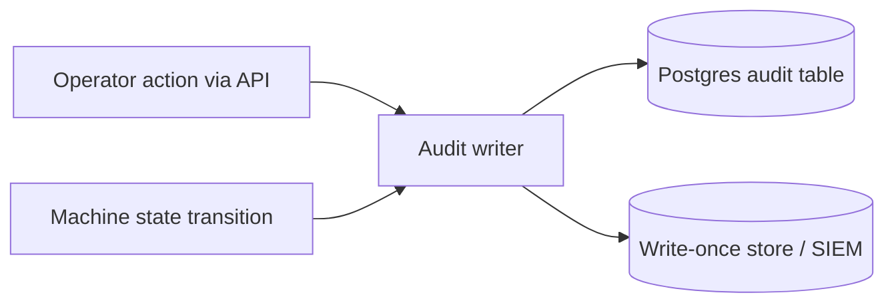
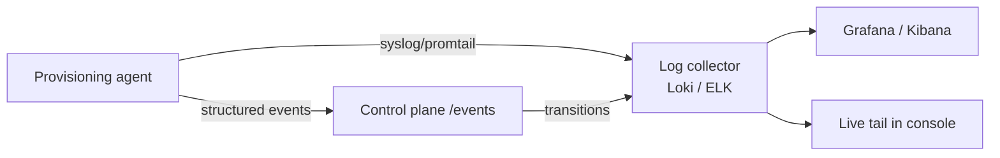

# 07 — Logging & Auditing

- **Audit** — who did what; immutable, identity-bound, low-volume, long retention
- **Observability logs** — what happened on machines/builds; high-volume, queryable, shorter retention

## 7.1 Audit trail

- Each record: actor (AD UPN / system / machine), action, target, before/after, NTP timestamp, request id, source IP
- Audited events:
  - Login / logout / failed login / RBAC denial
  - Binding create/update/delete (servers, image+version, action)
  - Power / next-boot actions
  - Retry / rollback / send-to-rescue
  - Image promote / deprecate
  - Machine lifecycle transitions
- Properties: append-only, mirrored to WORM/SIEM, queryable in UI by operator/machine/image/time

## 7.2 Provisioning logs (anti-"black box")

- Labeled with `machine_id`, `session`, `image_ref`, `stage`
- **Logs survive reboot** — shipped off-box in real time (+ persistent partition in install mode)
- Serial console captured (`console=ttyS0`); serial-over-LAN in UI where BMC supports it
- Stage transitions are both events (state machine/UI) and log lines

## 7.3 Build logs & provenance

- Per version: full CI build log, manifest/SBOM, base-vanilla provenance, checksum, signature
- "What's in this image + how built" always answerable

## 7.4 Centralized stack

- Log transport — promtail / rsyslog (alt: filebeat)
- Log store/query — Loki + Grafana (alt: ELK)
- Metrics — Prometheus + Grafana
- Audit mirror — syslog → WORM / SIEM
- Retention (tune to policy): audit ≥ 1–7 yrs; provisioning logs 30–90 days; build logs as long as image exists

## 7.5 Alerting

- Alerts on: provisioning failure rate, retries exhausted (`Held`), CI smoke-test failures, AD/auth outages, collector backlog
- Routed to the team owning the affected machines
