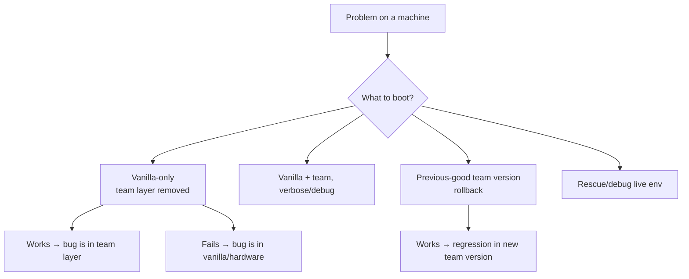
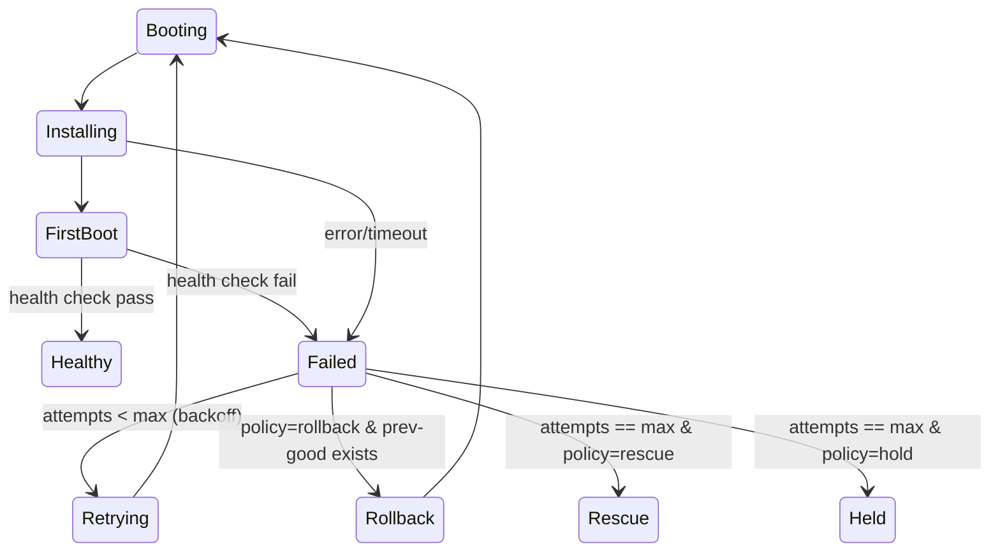

# 08 — Debuggability & Retry (Self-Healing Provisioning)

This directly answers: *"these two layers are not debuggable — if something goes
wrong, everything is 'I don't know.' Give me debugging in PXE too, machine-based
retry, all these options."* The strategy has two halves: **make failures visible**,
and **make recovery automatic**.

## 8.1 Why it's a black box today, and the fixes

| Cause of "I don't know" | Fix in this design |
| --- | --- |
| Layers are merged into one ISO; can't tell vanilla vs team | **Independent signed layers** + provenance → boot/compare each layer separately (8.2) |
| Logs vanish on the reboot after a failure | **Off-box log streaming** + persistent log partition (docs/07) |
| No way to get into a failing machine without media | **Rescue/debug boot target** always available over PXE (8.3) |
| No console visibility | **Serial console** capture + serial-over-LAN in UI |
| Failure = manual, ad-hoc re-try | **Policy-driven retry/rollback** state machine (8.4) |
| "Is the new image bad?" unknown until fleet-wide pain | **Canary ring + CI smoke-boot** before promote (8.6) |
| Can't reproduce an old build | **Reproducible builds + snapshots** (docs/03) |

## 8.2 Layer isolation — bisecting which layer broke

Because vanilla and team layers are separate, signed artifacts with provenance, the
control plane can offer (and the operator can pick) any of these boot targets for a
misbehaving machine:



- **Boot vanilla-only**: if it boots clean, the fault is in the team adaptation, not
  the base (or hardware). One click, no rebuild.
- **Boot previous-good version**: rollback source is the image catalog; isolates a
  regression introduced by a new team/vanilla version.
- **Diff layers**: since the team layer is a *delta squashfs*, the catalog can show a
  literal file-level diff of "what this version changed vs the last," and the SBOM diff
  of packages — so "what changed" is never a mystery.

## 8.3 Rescue / debug boot target

The iPXE menu (and the control plane fallback) **always** offers a rescue path — a
minimal live environment with networking, disk tools, the log shipper, and shell:

```ipxe
#!ipxe
# rescue.ipxe  — served on demand or on repeated failure
kernel .../rescue/vmlinuz boot=rescue console=ttyS0,115200 console=tty0 \
  session=${session} control=https://control.prov.example
initrd .../rescue/initrd.img
boot
```

In rescue the machine still **checks in and streams logs**, so an operator can triage
it live from the UI (serial-over-LAN / log tail) without walking to the rack. Rescue is
reachable: (a) on demand from the UI, (b) automatically when retries are exhausted, or
(c) via the iPXE fail path if the boot decision itself errors.

## 8.4 Retry & rollback policy (machine-based retry)

The control-plane state machine ([docs/02](docs/02-architecture.md)) makes recovery
automatic and bounded:



Per-binding (and per-team default) policy knobs:
- `max_retries` (default e.g. 3) with **exponential backoff** between attempts.
- **On exhaustion**: `rescue` (drop into debug env) or `hold` (park as `Held`,
  alert the owning team) — never silently loop or brick.
- **Rollback**: optionally auto-fall-back to the previous promoted version on repeated
  failure of a new version.
- **Idempotent provisioning**: each attempt is a clean, repeatable operation (fetch →
  verify → apply → health), so retrying is safe.
- **Timeouts/watchdog**: each stage has a deadline; a stuck machine is marked `Failed`
  and enters the policy instead of hanging forever.

Operators can also **force** retry / rollback / rescue per machine from the UI, and
every automatic or manual transition is **audited**.

## 8.5 First-boot health checks

The provisioning agent runs a health check after applying the layers and reports
`Healthy`/`Failed` (so "done" means *verified done*, not "stopped logging"). Checks
include: expected services up, network/identity applied correctly, team-defined
`post_install` validation script passed, disk/RAID sane. The **same** check runs in CI
smoke-boots — so an image that would fail health on the floor fails in CI first.

## 8.6 Canary ring & staged rollout

New image versions promote through rings: `CI smoke-boot → canary machine(s) →
fleet`. The catalog's lifecycle (`tested → promoted`) gates what operators can bind by
default. A bad version is caught on one canary, not across a team's fleet — and
rollback is one click.

## 8.7 Operator debugging toolkit (in the UI)

- Live per-machine log tail + serial-over-LAN console.
- One-click: **Retry**, **Rollback to previous**, **Boot vanilla-only**,
  **Send to rescue**, **Boot local disk**.
- Layer/SBOM **diff** between two versions.
- Full **boot timeline** per session (every stage transition with timestamps), so a
  failure shows exactly *where* it stopped.
