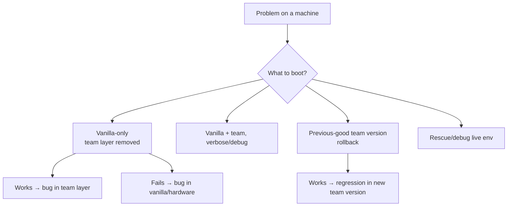
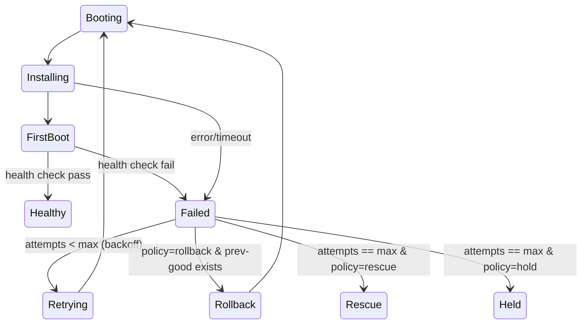

# 08 — Debuggability & Retry (Self-Healing Provisioning)

- Two halves: **make failures visible** + **make recovery automatic**

## 8.1 Why it's a black box today → fixes

- Layers merged into one ISO → **independent signed layers + provenance**, boot each separately
- Logs vanish on reboot → **off-box log streaming + persistent partition**
- No way into a failing machine → **rescue/debug boot over PXE**
- No console visibility → **serial capture + serial-over-LAN in UI**
- Ad-hoc retries → **policy-driven retry/rollback state machine**
- "Is the new image bad?" unknown → **canary ring + CI smoke-boot before promote**
- Can't reproduce old build → **reproducible builds + snapshots**

## 8.2 Layer isolation — bisect the broken layer



- **Boot vanilla-only** — boots clean → fault is in team layer, not base
- **Boot previous-good version** — isolates a regression (rollback source = catalog)
- **Diff layers** — team layer is a delta squashfs → file-level diff + SBOM diff of "what changed"

## 8.3 Rescue / debug boot target

- iPXE menu + control plane always offer a rescue path (minimal live env: networking, disk tools, log shipper, shell)

```ipxe
#!ipxe
kernel .../rescue/vmlinuz boot=rescue console=ttyS0,115200 console=tty0 \
  session=${session} control=https://control.prov.example
initrd .../rescue/initrd.img
boot
```

- In rescue, machine still checks in + streams logs → triage from UI without walking to rack
- Reachable: on demand, on retry exhaustion, or via iPXE fail path

## 8.4 Retry & rollback policy



- Policy knobs (per-binding + per-team default):
  - `max_retries` (default 3) + exponential backoff
  - On exhaustion: `rescue` or `hold` (park + alert) — never silent loop or brick
  - Optional auto-rollback to previous promoted version
  - Idempotent provisioning → safe to retry
  - Per-stage timeouts/watchdog → stuck machine marked Failed, enters policy
- Operators can force retry / rollback / rescue from UI; all transitions audited

## 8.5 First-boot health checks

- Agent runs health check after applying layers → reports Healthy/Failed
- "Done" = verified done, not "stopped logging"
- Checks: services up, network/identity applied, `post_install` passed, disk/RAID sane
- Same check runs in CI smoke-boots

## 8.6 Canary ring & staged rollout

- Rings: CI smoke-boot → canary machine(s) → fleet
- Catalog lifecycle (`tested → promoted`) gates default bindable versions
- Bad version caught on one canary, not fleet-wide; rollback one click

## 8.7 Operator debugging toolkit (UI)

- Live log tail + serial-over-LAN console
- One-click: Retry, Rollback to previous, Boot vanilla-only, Send to rescue, Boot local disk
- Layer/SBOM diff between two versions
- Full boot timeline per session (every stage + timestamps) → shows exactly where it stopped
