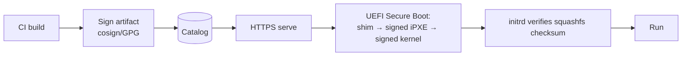

# 09 — Security & Hardening

Provisioning is a high-value target: whoever controls the boot image controls the
fleet. The design assumes that and defends accordingly.

## 9.1 Image integrity — build to boot

- **Signed artifacts**: every squashfs/ISO/kernel signed at build (cosign or GPG);
  catalog stores signatures.
- **Secure Boot**: signed shim → signed iPXE → signed kernel chain; the firmware
  refuses an unsigned/tampered kernel.
- **Checksum-pinned squashfs**: the kernel command line carries the expected hash; the
  initrd aborts on mismatch. Defends the (large, HTTP-served) rootfs too.
- **HTTPS + pinned CA** for all artifact + API traffic; no plaintext boot artifacts.

## 9.2 Secrets & per-machine identity

- **No secrets in shared images.** Per-team secret/IP material (static IPs, creds,
  certs, AD join key) is **injected at provision time** from a secrets store
  (**Vault**) / IPAM over the authenticated channel and written by the agent.
- Machine session tokens are **short-lived** and scoped to one binding/session.
- Operator tokens are short-lived OIDC; AD creds never reach our services (docs/06).

## 9.3 Network segmentation

- A dedicated, firewalled **provisioning VLAN**. proxyDHCP/TFTP/HTTP/control plane
  live here; egress is limited to AD, the secrets store, and the log stack.
- Targets are isolated during provisioning and only join their production VLAN once
  healthy (team netplan applied at first boot).
- proxyDHCP (not full DHCP) avoids interfering with — or being abused to redirect —
  production DHCP.

## 9.4 AuthN/Z & audit (cross-ref)

- OIDC + AD, **RBAC enforced server-side**, team-scoping (docs/06).
- **Immutable, identity-bound audit** mirrored to WORM/SIEM (docs/07).
- Failed logins, RBAC denials, and signature-verification failures are alerted.

## 9.5 Supply chain

- **Snapshotted apt mirror** (no live-internet apt during builds) → known, reproducible
  package sets and an **SBOM** per image.
- Builds run in clean, isolated CI; build provenance recorded.
- Periodic scan of mirror/images for known CVEs; promotion can gate on scan results.

## 9.6 Threat model (abridged)

| Threat | Mitigation |
| --- | --- |
| Rogue/tampered boot image | Secure Boot + artifact signing + checksum pinning |
| MITM on boot artifacts | HTTPS + pinned CA; signed kernels |
| Rogue DHCP / boot redirect | proxyDHCP on segmented VLAN; authenticated boot decision; signed chain |
| Stolen operator creds | OIDC + MFA via broker; short sessions; RBAC; audit |
| Secret leakage via shared image | Provision-time injection from Vault; nothing secret baked in |
| Insider misuse | Team-scoped RBAC + immutable audit + alerting |
| Lost forensic trail on failure | Off-box log streaming + WORM audit |
| Malicious machine spoofing events | Per-session scoped machine tokens |

## 9.7 Hardening baseline

Vanilla image ships a CIS-style baseline (minimal packages, no default creds, SSH
hardening, auditd, firewall defaults). Hardening lives in the **vanilla** layer so all
teams inherit it; teams can extend but the baseline is enforced centrally.
