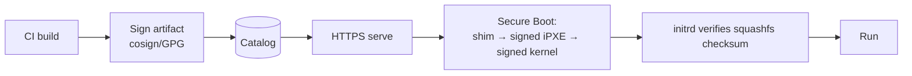

# 09 — Security & Hardening

- Whoever controls the boot image controls the fleet — design defends accordingly

## 9.1 Image integrity — build to boot

- Signed artifacts — every squashfs/ISO/kernel signed at build (cosign/GPG)
- Secure Boot — signed shim → iPXE → kernel; firmware refuses tampered kernel
- Checksum-pinned squashfs — hash on kernel cmdline; initrd aborts on mismatch
- HTTPS + pinned CA for all artifact + API traffic

## 9.2 Secrets & per-machine identity

- No secrets in shared images
- Per-team secret/IP material injected at provision time from Vault/IPAM, written by agent
- Machine session tokens short-lived, scoped to one binding/session
- Operator tokens short-lived OIDC; AD creds never reach our services

## 9.3 Network segmentation

- Dedicated firewalled provisioning VLAN; egress limited to AD, secrets store, log stack
- Targets isolated during provisioning; join production VLAN only when healthy
- proxyDHCP (not full DHCP) avoids interfering with / abusing prod DHCP

## 9.4 AuthN/Z & audit (cross-ref)

- OIDC + AD, RBAC enforced server-side, team-scoping (docs/06)
- Immutable identity-bound audit mirrored to WORM/SIEM (docs/07)
- Failed logins, RBAC denials, signature-verification failures alerted

## 9.5 Supply chain

- Snapshotted apt mirror (no live-internet apt) → reproducible package sets + SBOM
- Builds in clean isolated CI; provenance recorded
- Periodic CVE scan of mirror/images; promotion can gate on scan results

## 9.6 Threat model (abridged)

- Rogue/tampered image → Secure Boot + signing + checksum pinning
- MITM on artifacts → HTTPS + pinned CA + signed kernels
- Rogue DHCP / boot redirect → proxyDHCP on segmented VLAN + signed chain
- Stolen operator creds → OIDC + MFA + short sessions + RBAC + audit
- Secret leakage via shared image → provision-time injection from Vault
- Insider misuse → team-scoped RBAC + immutable audit + alerting
- Lost forensic trail → off-box log streaming + WORM audit
- Machine spoofing events → per-session scoped machine tokens

## 9.7 Hardening baseline

- Vanilla ships CIS-style baseline: minimal packages, no default creds, SSH hardening, auditd, firewall
- Hardening lives in vanilla layer → all teams inherit; teams extend but baseline enforced centrally
