# 10 — Implementation Roadmap

Phased so each phase delivers something testable and de-risks the next. Earlier
phases stand up the "boot something" path; later phases add the UI, auth, audit, and
self-healing. A pilot team and a couple of lab machines run alongside from Phase 3.

```mermaid
gantt
  title Delivery phases (relative, not calendar-bound)
  dateFormat X
  axisFormat %s
  section Foundations
  P0 Foundations            :p0, 0, 1
  section Images
  P1 Vanilla build          :p1, after p0, 1
  P2 Adaptation build       :p2, after p1, 1
  section Boot path
  P3 PXE boots vanilla      :p3, after p1, 1
  P4 Control plane + boot decision :p4, after p3, 1
  section Experience
  P5 Operator UI + AD auth  :p5, after p4, 1
  P6 Logging + audit        :p6, after p4, 1
  P7 Debug + retry + rollback :p7, after p5, 1
  section Hardening
  P8 Secure Boot + secrets + BMC :p8, after p7, 1
```

## Phase 0 — Foundations
- Repo + CI skeleton; provisioning VLAN; supporting VMs/containers.
- Stand up **snapshotted apt mirror** (aptly/pulp) and the **artifact catalog** store.
- **Exit:** CI can run; an apt snapshot exists; empty catalog reachable over HTTPS.

## Phase 1 — Vanilla image build
- `debootstrap` + chroot provisioning; initrd overlay-boot logic; squashfs + ISO;
  manifest/SBOM + signing; qemu smoke-boot + health check in CI.
- **Exit:** `vanilla-20.04-x.y.z` builds reproducibly, smoke-boots green, lands in catalog.

## Phase 2 — Adaptation build (pilot team)
- Declarative team spec → delta squashfs on pinned vanilla; merged ISO; provenance +
  SBOM + signing; smoke-boot merged image.
- **Exit:** `team-<pilot>-x.y.z` builds from spec, boots vanilla+overlay in a VM.

## Phase 3 — PXE boots vanilla (lab)
- dnsmasq proxyDHCP + TFTP + iPXE; HTTPS artifact serving; static iPXE script.
- **Exit:** a lab machine network-boots the vanilla (then pilot) image end to end.

## Phase 4 — Control plane + boot decisioning
- Postgres schema (machines/bindings/images/events/audit); `GET /boot`, `/events`;
  machine check-in + session tokens; discovery from leases/check-ins; state machine.
- **Exit:** binding a machine to an image (via API) makes it boot that image; events recorded.

## Phase 5 — Operator UI + AD auth
- React console: inventory grid, multi-select, pick image+action, provision; live
  status drawer. OIDC broker federating AD; group→role RBAC enforced server-side.
- **Exit:** an AD operator logs in and reimages selected lab machines from the UI.

## Phase 6 — Logging & auditing
- Central log stack (Loki/ELK); agent log streaming + persistent log partition; serial
  capture; immutable audit table mirrored to WORM/SIEM; UI audit + live tail.
- **Exit:** every action is audited under an AD identity; failed-boot logs survive reboot
  and are visible in the UI.

## Phase 7 — Debuggability & retry
- Retry/rollback/hold policy + backoff + watchdogs; rescue/debug boot target;
  vanilla-only + previous-version boot options; layer/SBOM diff; canary ring.
- **Exit:** a deliberately broken image auto-retries, rolls back/parks per policy, and is
  diagnosable from the UI without touching the machine.

## Phase 8 — Security hardening & scale
- Secure Boot signing chain; checksum-pinned squashfs; Vault provision-time secrets;
  IPMI/Redfish power + next-boot; CIS baseline; CVE scanning gate; HA for network
  services; per-rack HTTP caches.
- **Exit:** hands-off reimage via BMC; signed/verified boot; secrets injected at runtime;
  ready to widen beyond pilot.

## Cross-cutting throughout
- Reproducible builds, IaC for all services, runbooks, and tests (CI smoke-boot is the
  backbone). Each phase adds to the same repo layout from [docs/03 §3.8](03-iso-build-pipeline.md).

## Suggested pilot scope to validate the design early
One pilot team + 2–3 lab servers through Phases 1→5 proves the whole spine
(two-layer build → PXE → control plane → UI → AD login) before investing in
Secure Boot, BMC automation, and HA.
