# 10 — Implementation Roadmap

- Phased; each phase delivers something testable and de-risks the next
- Pilot team + lab machines run alongside from Phase 3

```mermaid
gantt
  title Delivery phases (relative)
  dateFormat X
  axisFormat %s
  section Foundations
  P0 Foundations            :p0, 0, 1
  section Images
  P1 Vanilla build          :p1, after p0, 1
  P2 Adaptation build       :p2, after p1, 1
  section Boot path
  P3 PXE boots vanilla      :p3, after p1, 1
  P4 Control plane + boot decision :p4, after p3, 1
  section Experience
  P5 Operator UI + AD auth  :p5, after p4, 1
  P6 Logging + audit        :p6, after p4, 1
  P7 Debug + retry + rollback :p7, after p5, 1
  section Hardening
  P8 Secure Boot + secrets + BMC :p8, after p7, 1
```

## Phase 0 — Foundations
- Repo + CI skeleton; provisioning VLAN; supporting VMs/containers
- Snapshotted apt mirror (aptly/pulp) + artifact catalog store
- **Exit:** CI runs; apt snapshot exists; empty catalog reachable over HTTPS

## Phase 1 — Vanilla image build
- debootstrap + chroot; initrd overlay-boot; squashfs + ISO; manifest/SBOM + signing; qemu smoke-boot
- **Exit:** vanilla builds reproducibly, smoke-boots green, in catalog

## Phase 2 — Adaptation build (pilot team)
- Team spec → delta squashfs on pinned vanilla; merged ISO; provenance + SBOM + signing; smoke-boot
- **Exit:** team image builds from spec, boots vanilla+overlay in VM

## Phase 3 — PXE boots vanilla (lab)
- dnsmasq proxyDHCP + TFTP + iPXE; HTTPS artifacts; static iPXE script
- **Exit:** lab machine network-boots vanilla (then pilot) end to end

## Phase 4 — Control plane + boot decisioning
- Postgres schema; `GET /boot`, `/events`; machine check-in + session tokens; discovery; state machine
- **Exit:** binding a machine (via API) makes it boot that image; events recorded

## Phase 5 — Operator UI + AD auth
- React console: inventory, multi-select, pick image+action, provision, live status
- OIDC broker federating AD; group→role RBAC server-side
- **Exit:** AD operator logs in and reimages selected lab machines from UI

## Phase 6 — Logging & auditing
- Central log stack; agent log streaming + persistent partition; serial capture; immutable audit → WORM/SIEM; UI audit + live tail
- **Exit:** every action audited under AD identity; failed-boot logs survive reboot + visible in UI

## Phase 7 — Debuggability & retry
- Retry/rollback/hold policy + backoff + watchdogs; rescue boot; vanilla-only + previous-version boot; layer/SBOM diff; canary ring
- **Exit:** broken image auto-retries, rolls back/parks per policy, diagnosable from UI

## Phase 8 — Security hardening & scale
- Secure Boot signing; checksum-pinned squashfs; Vault provision-time secrets; IPMI/Redfish power; CIS baseline; CVE gate; HA; per-rack caches
- **Exit:** hands-off BMC reimage; signed/verified boot; secrets at runtime; ready to widen

## Cross-cutting
- Reproducible builds, IaC, runbooks, tests; CI smoke-boot is the backbone

## Suggested pilot
- 1 team + 2–3 lab servers through Phases 1→5 proves the spine before Secure Boot / BMC / HA
